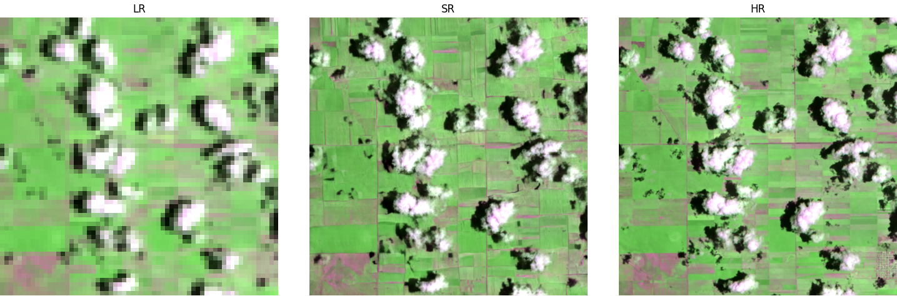

[](https://pypi.org/project/opensr-srgan/)

[](LICENSE)
[](https://srgan.opensr.eu)
[](https://github.com/simon-donike/SISR-RS-SRGAN/actions/workflows/ci.yml)
[](https://codecov.io/gh/simon-donike/SISR-RS-SRGAN)




# 🌍 Single Image Super-Resolution Remote Sensing 'SRGAN'

**Remote-Sensing-SRGAN** is a research-grade GAN framework for **super-resolution of Sentinel-2 and other remote-sensing imagery**. It supports arbitrary band counts, configurable generator/discriminator designs, scalable depth/width, and a modular loss system designed for stable GAN training on EO data.

---

## 📖 Documentation

Full docs live at **[srgan.opensr.eu](https://srgan.opensr.eu/)**. They cover usage, configuration, training recipes, and deployment tips in depth.

## 🧠 Highlights

* **Flexible models:** swap between SRResNet, RCAB, RRDB, and LKA-style generators with YAML-only changes.
* **Remote-sensing aware losses:** combine spectral, perceptual, and adversarial objectives with tunable weights.
* **Stable training loop:** generator pretraining, adversarial ramp-ups, EMA, and multi-GPU Lightning support out of the box.
* **PyPI distribution:** `pip install opensr-srgan` for ready-to-use presets or custom configs.
* **Extensive Logging:** Logging all important information automatically to `WandB` for optimal insights.

---

## 🏗️ Configuration Examples

All key knobs are exposed via YAML in the `opensr_srgan/configs` folder:

* **Model**: `in_channels`, `n_channels`, `n_blocks`, `scale`, `block_type ∈ {SRResNet, res, rcab, rrdb, lka}`
* **Losses**: `l1_weight`, `sam_weight`, `perceptual_weight`, `tv_weight`, `adv_loss_beta`
* **Training**: `pretrain_g_only`, `g_pretrain_steps`, `adv_loss_ramp_steps`, `label_smoothing`, generator LR warmup (`Schedulers.g_warmup_steps`, `Schedulers.g_warmup_type`), discriminator cadence controls
* **Data**: band order, normalization stats, crop sizes, augmentations

---

## 🎚️ Training Stabilization Strategies

* **G‑only pretraining:** Train with content/perceptual losses while the adversarial term is held at zero during the first `g_pretrain_steps`.
* **Adversarial ramp‑up:** Increase the BCE adversarial weight **linearly** or smoothly (**cosine**) over `adv_loss_ramp_steps` until it reaches `adv_loss_beta`.
* **Generator LR warmup:** Ramp the generator optimiser with a **cosine** or **linear** schedule for the first 1–5k steps via `Schedulers.g_warmup_steps`/`g_warmup_type` before switching to plateau-based reductions.
* **EMA smoothing:** Enable `Training.EMA.enabled` to keep a shadow copy of the generator. Decay values in the 0.995–0.9999 range balance responsiveness with stability and are swapped in automatically for validation/inference.

The schedule and ramp make training **easier, safer, and more reproducible**.

---

## ⚙️ Config‑driven components

| Component | Options | Config keys |
|-----------|---------|-------------|
| **Generators** | `SRResNet`, `res`, `rcab`, `rrdb`, `lka` | `Generator.model_type`, depth via `Generator.n_blocks`, width via `Generator.n_channels`, kernels and scale. |
| **Discriminators** | `standard` SRGAN CNN, `patchgan` | `Discriminator.model_type`, granularity with `Discriminator.n_blocks`. |
| **Content losses** | L1, Spectral Angle Mapper, VGG19/LPIPS perceptual metrics, Total Variation | Weighted by `Training.Losses.*` (e.g. `l1_weight`, `sam_weight`, `perceptual_weight`, `perceptual_metric`, `tv_weight`). |
| **Adversarial loss** | BCE‑with‑logits on real/fake logits | Warmup via `Training.pretrain_g_only`, ramped by `adv_loss_ramp_steps`, capped at `adv_loss_beta`, optional label smoothing. |

The YAML keeps the SRGAN flexible: swap architectures or rebalance perceptual vs. spectral fidelity without touching the code.


## 🧰 Installation

Follow the [installation instructions](https://srgan.opensr.eu/getting-started/installation/) for package, source, and dependency setup options.

---

## 🚀 Quickstart

* **Datasets:** Grab the bundled example dataset or learn how to register your own sources in the [data guide](https://srgan.opensr.eu/data/).
* **Training:** Launch training with `python -m opensr_srgan.train --config opensr_srgan/configs/config.yaml` or import `train` from the package as described in the [training walkthrough](https://srgan.opensr.eu/getting-started/training/).
* **Inference:** Ready-made presets and large-scene pipelines are described in the [inference section](https://srgan.opensr.eu/getting-started/inference/).

---

## 🏗️ Configuration & Stabilization

All tunable knobs—architectures, loss weights, schedulers, and EMA—are exposed via YAML files under `opensr_srgan/configs`. Strategy tips for warm-ups, adversarial ramps, and EMA usage are summarised in the [training concepts chapter](https://srgan.opensr.eu/training/concepts/).


## 📂 Repository Structure

```
SISR-RS-SRGAN/
├── opensr_srgan/         # Library + training code
├── docs/                 # MkDocs documentation sources
├── paper/                # Publication, figures, and supporting material
├── pyproject.toml        # Packaging metadata
└── requirements.txt      # Development dependencies
```

## Contribution and Issues
If you wish to contribute (such as new models, data or functionalities), please review the contribution guidelines and open a PR here on GitHub. If you're having problems or need support, please open an Issue here on GitHub.


---

## 📚 Related Projects

* **OpenSR-Model** – Latent Diffusion SR (LDSR-S2)
* **OpenSR-Utils** – Large-scale inference & data plumbing
* **OpenSR-Test** – Benchmarks & metrics
* **SEN2NEON** – Multispectral HR reference dataset

---

## ✍️ Citation

If you use this work, please cite:

```bibtex
coming soon...
```

---

## 🧑‍🚀 Authors & Acknowledgements

Developed by **Simon Donike** (IPL–UV) within the **ESA Φ-lab / OpenSR** initiative.

---

