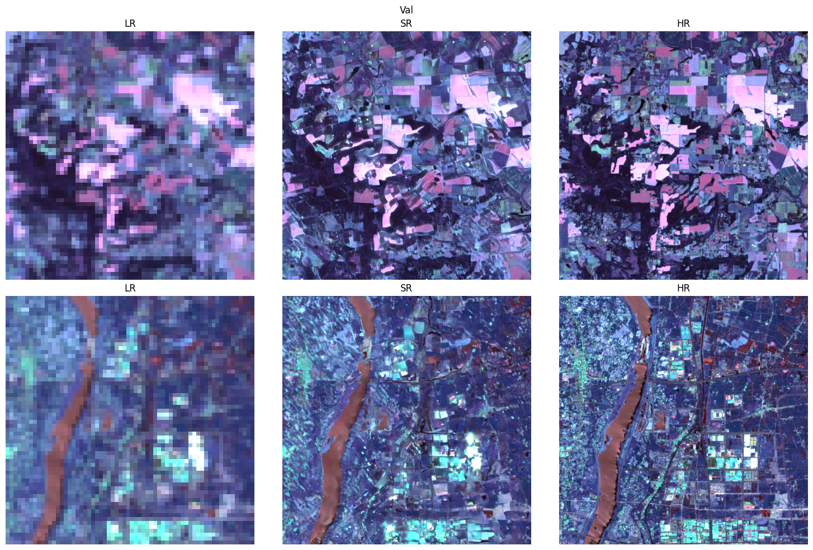

# ESA OpenSR

ESA OpenSR is an end-to-end research stack for single-image super-resolution (SISR) of multispectral Earth observation data. The
project packages a robust SRGAN implementation together with remote-sensing focused preprocessing, evaluation, and experiment
management utilities. It grew out of production work on Sentinel-2 imagery and is designed to be easily adapted to other satellites
and aerial sensors that provide paired low- and high-resolution observations.

## What makes ESA OpenSR different?

* **Remote-sensing aware design.** Normalisation, histogram matching, and band handling are all tuned for common Sentinel-2 value
  ranges and spectral characteristics so you can train without rewriting boilerplate.
* **Config-driven experimentation.** Every major architectural or training choice is exposed through YAML. Switching between
  generator backbones, loss weights, or datasets is a matter of editing a few fields.
* **Production-ready training loop.** PyTorch Lightning wraps the adversarial optimisation, warm-start schedules, checkpointing,
  logging, and multi-GPU friendly data loading.
* **Extensible generator and discriminator zoo.** Choose from SRResNet, residual channel attention (RCAB), RRDB, large-kernel
  attention, and conditional GAN variants, with matching discriminators ranging from classic SRGAN to PatchGAN.

## Repository tour

| Path | Description |
| --- | --- |
| `model/` | Lightning module, generator and discriminator implementations, and loss definitions. |
| `data/` | Dataset wrappers and helper utilities for Sentinel-2 SAFE archives and the SEN2NAIP world-wide corpus. |
| `configs/` | Ready-to-run YAML presets for 10 m and 20 m Sentinel-2 training configurations. |
| `utils/` | Logging helpers, spectral normalisation utilities, and model summary functions used across the stack. |
| `train.py` | Command-line entry point that wires configuration, data module, loggers, and the Lightning trainer together. |

## Typical workflow

1. **Pick a configuration.** Start from `configs/config_20m.yaml` or `configs/config_10m.yaml` and adjust dataset paths, scale,
   and architecture selections to match your experiment.
2. **Prepare datasets.** Point the config to a Sentinel-2 SAFE manifest or the SEN2NAIP worldwide dataset and verify that the
   required bands exist on disk (see [Data](data.md)).
3. **Launch training.** Run `python train.py --config <path>` to instantiate the Lightning module, configure optimisers and
   callbacks, and start adversarial training (see [Training](training.md)).
4. **Monitor progress.** Use the included Weights & Biases and TensorBoard logging to track perceptual losses, adversarial
   metrics, and validation imagery.
5. **Deploy or evaluate.** The Lightning module exposes `predict_step` for batched inference, automatically normalising inputs and
   matching output histograms to the low-resolution source.

## Learn more

* [Architecture](architecture.md) explains how the Lightning module orchestrates generators, discriminators, and losses.
* [Configuration](configuration.md) documents every YAML field and how it influences training.
* [Data](data.md) details the supported datasets and how to integrate your own.
* [Getting started](getting-started.md) walks through environment setup and the first training run.
* [Training](training.md) covers logging, callbacks, and practical tips for stable optimisation.

Whether you are reproducing published results or exploring new remote-sensing modalities, ESA OpenSR gives you a clear and
extensible foundation for multispectral super-resolution research.
