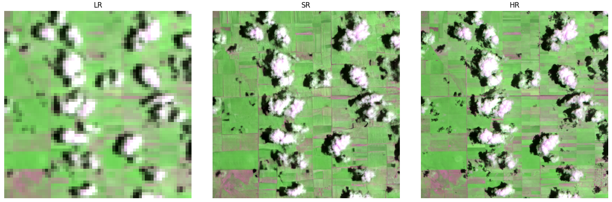

# SISR-RS-SRGAN

| **Runtime** | **Docs / License** | **Tests** |
|:-----------:|:------------------:|:---------:|
|   |   |   |

SISR-RS-SRGAN is a comprehensive toolkit for training and evaluating super-resolution GANs on remote-sensing imagery. It packages a flexible generator/discriminator zoo, composable perceptual and reconstruction losses, and the training heuristics
that make adversarial optimisation tractable—generator warm-up phases, learning-rate scheduling, adversarial-weight ramping, and more. All options are driven by concise YAML configuration files so you can explore new architectures or datasets without
rewriting pipelines.  
  
Whether you are reproducing published results, exploring new remote-sensing modalities, or are trying to esablish some benchmarks, SISR-RS-SRGAN gives you a clear and extensible foundation for multispectral super-resolution research.

> This repository and the configs represent the experiences that were made with SR-GAN training for remote sensing imagery. It's neither complete nor claims to perform SOTA SR, but it implements all tweaks and tips that make training SR-GANs easier.

## Why this repository?

* **One configuration, many models.** Swap between RCAN-style residual channel attention, RRDB, SRResNet, SwinIR-inspired
  backbones, and matching discriminators ranging from classic SRGAN to PatchGAN by editing a single config block.
* **Loss combinations that just work.** Mix pixel, perceptual, style, and adversarial objectives with sensible defaults for
  weights, schedules, and warm-up durations.
* **Battle-tested training loop.** PyTorch Lightning handles mixed precision, gradient accumulation, multi-GPU training, and
  restartable checkpoints while the repo layers in GAN-specific tweaks such as adversarial weight ramping and learning-rate
  restarts.
* **Lightning 1.x ↔ 2.x compatibility.** The trainer detects the installed Lightning version at runtime and routes to the appropriate automatic- or manual-optimisation step so your configs run unchanged across releases.
* **Remote-sensing aware defaults.** Normalisation, histogram matching, spectral-band handling, and Sentinel-2 SAFE ingestion are
  ready-made for 10 m and 20 m bands and easily extendable to other sensors.

## What you get out of the box

| Capability | Highlights |
| --- | --- |
| **Generators & discriminators** | RCAB, RRDB, residual-in-residual, large-kernel attention, PatchGAN, UNet-based discriminators, and more. |
| **Losses** | Weighted combinations of L1/L2, perceptual (VGG/LPIPS), style, and relativistic adversarial losses. |
| **Training utilities** | Generator warm-up phases, on-plateau learning-rate schedules, adversarial-weight ramping, EMA tracking, and mixed-precision support. |
| **Experiment management** | Configurable logging (Weights & Biases, TensorBoard), checkpointing, and experiment reproducibility hooks. |
| **Datasets** | Bundled example dataset for quick smoke tests plus a selector designed for custom collections. |
| **Deployment** | PyPI package (`opensr-srgan`) with helpers to load Lightning modules from configs or download pre-trained presets from the Hugging Face Hub. |

## Install in two ways

* **From PyPI for inference** – `python -m pip install opensr-srgan` installs the lightweight package that exposes
  `load_from_config` and `load_inference_model`. The former instantiates a Lightning module from any repo config +
  checkpoint path, while the latter fetches the published RGB-NIR and SWIR presets from the
  [`simon-donike/SR-GAN`](https://huggingface.co/simon-donike/SR-GAN) space on Hugging Face.
* **From source for training & development** – clone this repository when you want to modify architectures, retrain
  models, or work on new datasets. The [Getting started](getting-started.md) guide covers environment setup.

## Repository Tour

| Path | Description |
| --- | --- |
| `opensr_srgan/model/` | Lightning module, generator and discriminator implementations, and loss definitions. |
| `opensr_srgan/data/` | Dataset wrappers and helper utilities for Sentinel-2 SAFE archives and the SEN2NAIP world-wide corpus. |
| `opensr_srgan/configs/` | Ready-to-run YAML presets covering common scale factors, band selections, and architecture pairings. |
| `opensr_srgan/utils/` | Logging helpers, spectral normalisation utilities, and model summary functions used across the stack. |
| `opensr_srgan/train.py` | Command-line entry point that wires configuration, data module, loggers, and the Lightning trainer together. |

## Typical workflow

1. **Pick a configuration.** Start from a preset in `opensr_srgan/configs/` and adapt dataset paths, scale, generator, discriminator, and loss
   options to match your experiment.
2. **Prepare datasets.** Download the bundled example dataset or register your own source with the dataset selector (see
   [Data](data.md)).
3. **Launch training.** Run `python -m opensr_srgan.train --config <path>` or import `train` from the package to instantiate the
   Lightning module, configure optimisers and callbacks, and start adversarial training (see [Training](training.md)).
4. **Monitor progress.** Use the included Weights & Biases logging to track perceptual losses, adversarial
   metrics, and validation imagery.
5. **Deploy or evaluate.** The Lightning module exposes `predict_step` for batched inference, automatically normalising inputs and
   matching output histograms to the low-resolution source.

## Learn more

* [Architecture](architecture.md) explains how the Lightning module orchestrates generators, discriminators, and losses.
* [Configuration](configuration.md) documents every YAML field and how it influences training.
* [Data](data.md) details the supported datasets and how to integrate your own.
* [Getting started](getting-started.md) walks through environment setup and the first training run.
* [Training](training.md) covers logging, callbacks, and practical tips for stable optimisation.
* [Results](results.md) showcases results for some generator/discriminator and dataset combinations.

## ESA OpenSR
SISR-RS-SRGAN is part of the ESA [OpenSR](https://www.opensr.eu) ecosystem — an open framework for trustworthy super-resolution of multispectral satellite imagery. Within this initiative, this repository serves as the adversarial benchmark suite: it provides standardized GAN architectures, training procedures, and evaluation utilities that complement the other model types implemented in the project (diffusion, transformers, regression) and interfaces with from companion packages such as opensr-utils.