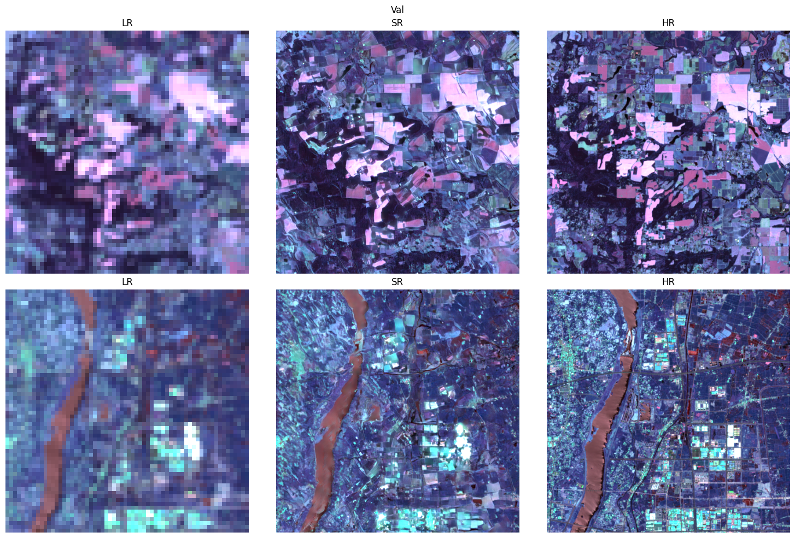

# Results

## RCAB generator + standard discriminator (8× Sentinel-2 20 m → 2.5 m)

**Configuration**
- Generator: RCAB backbone with residual channel attention blocks
- Discriminator: Standard SRGAN discriminator
- Upscaling factor: 8×

**Dataset**
- Sentinel-2 Level-2A tiles using the six 20 m bands (B5, B6, B7, B8A, B11, B12)
- Low-resolution inputs generated via bicubic downsampling to 160 m ground sampling distance
