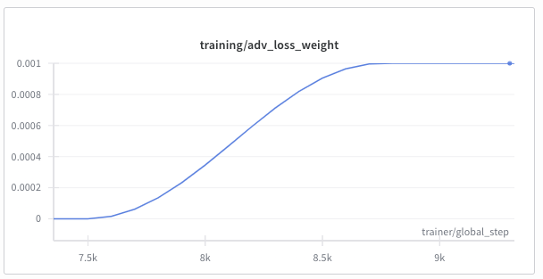

# Training Guide
This section goes over the most important metrics and settings to achieve a balanced generator/discriminator adversarial training, where both models converge and learn from each other.

## Best Practices
It is recommended to use the training warmups and schedulers as explained above. The following images present how these rpactices are reflected in the logs.

#### Generator LR Warmup
When starting to train, the learning rate slowly raises from 0 to the indicated value. This prevents exploding gradients after a random initialization of the weights when training the model from scratch. The length of the LR warmup is defined with the `Schedulers.g_warmup_steps` parameter in the config. Wether the increase is linear or more smooth is defined with the `Schedulers.g_warmup_type` setting, ideally this should be set to `cosine`.

#### Generator Pre-training
After the loss stabilizes, the generator continues to be trained while the discriminator sits idle. This prevents the discriminator form overpowering the generator in early stages of the training, where the generator output is easily identifyable as synthetic. The binary flag `training/pretrain_phase` is logged to indicate wether the model is still in pretraining or not. Wether the pretraining is enabled or not is defined with the `Training.pretrain_g_only` parameter in the config, the parameter `Training.g_pretrain_steps` defines how many steps this pretraining takes in total. The parameter `Training.g_warmup_steps` decides how many training steps (batches) this smooth LR increase takes, setting it to `0` turns it off.

#### Discriminator 
Once the `training/pretrain_phase` flag is `0`, pretraining of the generator is no longer active and the discriminator starts to be trained. Not only is is trained, but it's true/false prediction is also added to the generator to start the adversarial *game*. In order not to train the generator on the low-quality output of the discriminator at this early stageg, we only gradually feed the discriminators output to the generator as a loss. For that, we slowly increase the adversarial loss weight from `0` to the predetermined amount. The loss weight is logged to WandB in order to visualize the influnce this loss has on the generator.

#### Continued Training
As training continues, the generator is trying to fool the discriminator and the discriminator is trying to distinguish between true/synthetic, we monitor the overall loss of the models independantly. When the overall loss metric of one model reaches a plateau, we reduce it's learning rate in order to optimnally train the model.
. The patience, LR decrease factor inc ase of plateau and the metric to be used for these LR schedulers are all defined individually for $G$ and $D$ in the `Schedulers.` section of the config file.

#### Final stages of the Training
With further progression of the training, it is important not only to monitor the absolute reconstruction quality of the generator, but also to keep an eye on the balance between the generator and discriminator. Ideally, we try to reach the Nash equilibrium, where the discriminator can not distinguish between real and synthetic anymore, meaning the super-resolution is (at least fdor the discriminator) indistinguishable from the real high-resolution image. This equilibrium is achieved when both $D(y)$ and $D(G(x))$ approach `0.5`.

