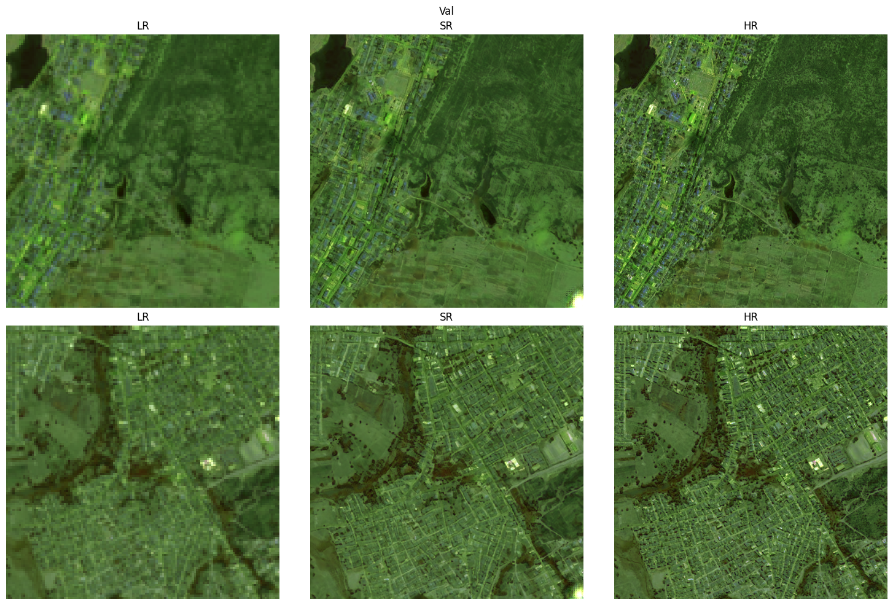

# Remote-Sensing-SRGAN: A Flexible Super-Resolution Framework for Multispectral Earth Observation Data

## Summary

We present *Remote-Sensing-SRGAN*, an open and modular framework for single-image (SI) super-resolution (SR) in Earth Observation (EO).  
The package unifies multiple GAN-based architectures under a common, configuration-driven design that supports flexible generator and discriminator definitions, adjustable scale factors, and multispectral inputs such as Sentinel-2.

Weighted combinations of spectral and perceptual losses enable fine control over reconstruction fidelity and visual realism.  
A configuration-first philosophy drives reproducible experimentation, with all model, loss, and schedule parameters defined via concise configuration files.  
The training pipeline stabilizes adversarial optimization through generator pretraining, linear adversarial-weight ramping, cosine learning-rate warmup, and optional exponential moving-average (EMA) smoothing.

Integration with the *OpenSR* ecosystem provides data interfaces for Sentinel-2 SAFE and SEN2NAIP datasets, and scalable large-scene inference through `opensr-utils`.  
All common training optimizations for GAN training are implemented, creating a ready-to-use boilerplate for training notoriously unstable GANs on remote-sensing data.

The framework lowers the barrier for researchers and practitioners to build, benchmark, and deploy robust GAN-based SR models across diverse EO datasets.

## Introduction

#### Remote Sensing

Optical satellite imagery plays a key role in monitoring the Earth's surface for applications such as agriculture [@agriculture], land cover mapping [@mapping], ecosystem assessment [@ecosysetm], and disaster management [@disaster].  
The European Space Agency’s Sentinel-2 mission provides freely available multispectral imagery at 10 m spatial resolution with a revisit time of five days, enabling dense temporal monitoring at global scale.  

In contrast, very-high-resolution sensors, such as Pleiades or SPOT, offer much richer spatial detail but limited temporal coverage and high acquisition costs.  
Consequently, a trade-off exists between spatial and temporal resolution in Earth-observation (EO) imagery.

#### Super-Resolution

Single-image super-resolution (SISR) aims to enhance the spatial detail of low-resolution (LR) observations by learning a mapping to a plausible high-resolution (HR) counterpart.  
In remote sensing, SR can bridge the gap between freely available medium-resolution imagery and costly commercial data, potentially improving downstream tasks such as land-cover classification, object detection, and change detection.  

The advent of deep convolutional networks led to major breakthroughs in both reconstruction fidelity and perceptual realism [@dong2015imagesuperresolutionusingdeep; @kim2016deeplyrecursiveconvolutionalnetworkimage].

#### GANs

Generative Adversarial Networks (GANs) [@goodfellow2014generativeadversarialnetworks] introduced an adversarial learning framework in which a generator and a discriminator are trained in competition, enabling the synthesis of realistic, high-frequency image details.  
Since their introduction, GANs have been rapidly adopted in the remote-sensing community for tasks such as cloud removal, image translation, domain adaptation, and data synthesis [@11159252; @su2024intriguingpropertycounterfactualexplanation].  
These applications demonstrated the potential of adversarial training to generate spatially coherent and perceptually plausible remote-sensing imagery.

Building on these successes, the computer-vision community introduced the Super-Resolution GAN (SRGAN) [@ledig2017photo], which combined perceptual and adversarial losses to reconstruct photo-realistic high-resolution images from their low-resolution counterparts.  
The approach inspired a wave of research applying SRGAN-like architectures to remote-sensing super-resolution [@rs15205062; @9787539; @10375518; @satlassuperres], where the ability to recover fine spatial detail from coarse observations can significantly enhance analysis of land cover, infrastructure, and environmental change.

Recent advances in diffusion and transformer-based architectures have shifted the state of the art in image super-resolution toward generative models with stronger probabilistic and contextual reasoning [@s1; @s2; @s3].  
Nevertheless, GAN-based approaches continue to be actively explored [@g1] and remain a practical choice for operational production settings [@allen].

## Problem Statement

Despite their success in computer vision, Generative Adversarial Networks (GANs) remain notoriously difficult to train [@p1; @p2; @p3].  
The simultaneous optimization of generator and discriminator networks often leads to unstable dynamics, mode collapse, and high sensitivity to hyperparameters.  

In remote-sensing applications, these issues are amplified by domain-specific challenges such as multispectral or hyperspectral inputs, high dynamic range reflectance values, varying sensor characteristics, and limited availability of perfectly aligned high-resolution ground-truth data.  

Moreover, researchers in remote sensing rarely work with fixed RGB imagery.  
They frequently need to adapt existing GAN architectures to support arbitrary numbers of spectral bands, retrain models for different satellite sensors (e.g., Sentinel-2, SPOT, Pleiades, PlanetScope), or implement benchmarks for newly collected datasets.  
These modifications usually require non-trivial changes to the model architecture, preprocessing pipeline, and loss configuration, making reproducibility and experimentation cumbersome.  

Implementing the full set of heuristics that make GAN training stable—such as generator pretraining, adversarial loss ramping, label smoothing, learning-rate warmup, and exponential moving-average (EMA) tracking—adds another layer of complexity.  
Consequently, reproducing and extending GAN-based SR models in the Earth-Observation (EO) domain is often time-consuming, fragile, and inconsistent across studies.

## Contribution Summary

*Remote-Sensing-SRGAN* was developed to address these challenges by providing a unified, modular, and extensible framework for training and evaluating GAN-based super-resolution models in remote sensing.  
The software integrates multiple state-of-the-art SR architectures, loss functions, and training strategies within a configuration-driven design that allows users to flexibly adapt experiments without modifying the source code.

The main contributions of this work include:

- **Modular GAN framework:** Supports interchangeable generator and discriminator architectures with customizable depth, width, and scale factors.  
- **Configuration-first workflow:** Enables fully reproducible training and evaluation through concise YAML files, independent of code changes.  
- **Training stabilization techniques:** Includes generator pretraining, adversarial ramp-up, learning-rate warmup, label smoothing, and EMA smoothing.  
- **Multispectral compatibility:** Provides native support for arbitrary band configurations from different satellite sensors.  
- **OpenSR ecosystem integration:** Connects seamlessly to the SEN2NAIP dataset, leverages the unified evaluation framework `opensr-test` [@osrtest], and supports scalable inference via `opensr-utils` [@osrutils].

Together, these features make *Remote-Sensing-SRGAN* a reliable boilerplate for researchers and practitioners to train, benchmark, and deploy GAN-based SR models across diverse Earth-observation datasets and sensor types.

## Software Overview and Framework Design

*Remote-Sensing-SRGAN* follows a modular and configuration-driven architecture. All model definitions, loss compositions, and training schedules are controlled through a single YAML configuration file, ensuring that experiments remain reproducible and easily adaptable to new sensors, band configurations, or datasets. The framework is implemented in PyTorch and PyTorch Lightning, providing seamless GPU acceleration and built-in experiment logging.  

The system consists of four main components:  

- A flexible **generator–discriminator architecture** supporting multiple SR backbones.  
- A configurable **multi-loss system** combining pixel, perceptual, spectral, and adversarial objectives.  
- A robust **training pipeline** with pretraining, warmup, ramp-up, and EMA stabilization mechanisms.  
- Integration with the **OpenSR ecosystem** for dataset access, evaluation (`opensr-test`), and large-scale inference (`opensr-utils`).  

### Generator Architectures

The generator network can be configured with the different backbone types outlined in [Table&nbsp;1](#tab:arch), each providing a unique trade-off between complexity, receptive field, and textural detail.  

Table: **Implemented generator types and their characteristics.**

| **Generator Type** | **Description** |
|:-------------------|:----------------|
| `res` [@ledig2017photo] | SRResNet generator using residual blocks without batch normalization. Stable and effective for content pretraining. |
| `rcab` [@rcab] | Residual Channel Attention Blocks. Adds channel-wise reweighting to enhance textures and small structures. |
| `rrdb` [@rrdb] | Residual-in-Residual Dense Blocks (RRDB) as in ESRGAN. Deep structure with dense connections, improving detail sharpness. |
| `lka` [@lka] | Large-Kernel Attention blocks. Capture wide spatial context, beneficial for structured RS patterns (e.g., fields, roads). |
| `cgan` | stoachastic Conditional Generator with *NoiseResBlock*. |

The `Generator` class provides a unified implementation of SR backbones that share a common convolutional structure while differing in their internal residual block design.  
The module is initialized with a `block_type` flag selecting one of `{res, rcab, rrdb, lka, cgan}`, each drawn from a shared registry of block factories.  
Given an input tensor $x$, the model applies a wide receptive-field head convolution, followed by $N$ residual blocks of the selected type, a tail convolution for residual fusion, and an upsampling module that increases spatial resolution by a factor of 2, 4, or 8.  
The network ends with a linear output head producing the super-resolved image:

$$
x' = \mathrm{Upsample}\!\left( \mathrm{Conv}_{\text{tail}}\!\left(\mathrm{Body}(x_{\text{head}}) + x_{\text{head}}\right)\! \right)
$$

This modular structure allows researchers to experiment with different block designs—standard residual, channel attention (RCAB), dense residual (RRDB), large-kernel attention (LKA), or noise-conditioned variants—without altering the training pipeline or configuration schema.  
All models share identical input–output interfaces and residual scaling for stability, ensuring drop-in interchangeability across experiments.

#### Conditional Generator with Noise Injection

The `cgan` variant extends the standard generator by conditioning on both the low-resolution image and a latent noise vector $z$.  
It replaces standard residual blocks with *NoiseResBlocks*, which introduce controlled stochasticity through feature modulation.  
Each `NoiseResBlock` uses a small Multi-Layer Perceptron (MLP) to project the noise code $z\!\in\!\mathbb{R}^{d}$ into per-channel scale and bias parameters $(\gamma, \beta)$ that modulate intermediate activations before the nonlinearity:

$$
x_{\text{mod}} = (1 + \gamma)\odot \mathrm{Conv}_1(x) + \beta
$$

followed by a second convolution and residual fusion:

$$
x' = x + \mathrm{Conv}(\mathrm{PReLU}(x_{\text{mod}})) \cdot s
$$

where $s$ is a residual scaling factor.  
This mechanism maintains spatial coherence while enabling the generation of multiple plausible high-frequency realizations for the same LR input.  
During training, a random noise vector is sampled per image; during inference, users may supply explicit latent codes or fix random seeds for deterministic behavior.  
The module also exposes `sample_noise(batch_size)` and a `return_noise` flag for reproducibility and logging.  

### Discriminator Architectures

The discriminator can be selected to prioritize either global consistency or fine local realism. The different arcitechtures are outlined in [Table&nbsp;2](#tab:disc).

Table: **Implemented discriminator types and their purposes.** {#tab:disc}

| **Discriminator Type** | **Description** |
|:-----------------------|:----------------|
| `standard` [@ledig2017photo] | A global SR-GAN-style CNN discriminator that judges the overall realism of the full image. Promotes coherent global structure. |
| `patchgan` [@patchgan] | A PatchGAN discriminator that outputs patch-level predictions. Focuses on local realism and texture detail. Patch size is implicitly controlled by network depth (`n_blocks`). |

Two discriminator variants are implemented to complement the different generator types: a global `Discriminator` and a local `PatchGANDiscriminator`. Both are built from shared convolutional blocks with LeakyReLU activations and instance normalization.

The standard discriminator follows the original SRGAN [@ledig2017photo] design and evaluates the realism of the entire super-resolved image and the actual HR image. It stacks a sequence of strided convolutional layers with progressively increasing feature channels, an adaptive average pooling layer to a fixed spatial size, and two fully connected layers producing a scalar real/fake score. This “global” discriminator promotes coherent large-scale structure and overall photorealism.

The `PatchGANDiscriminator` instead outputs a grid of patch-level predictions, classifying each overlapping region as real or fake. Built upon the CycleGAN/pix2pix [@cyclegan; @px2px] reference implementation, it uses a configurable number of convolutional layers and normalization schemes (batch, instance, or none). The resulting patch map acts as a spatial realism prior, emphasizing texture fidelity and fine detail. Together, these architectures allow users to select the appropriate adversarial granularity: global consistency through SRGAN-style discrimination, or local realism through PatchGAN.

### Training Features

Training stability is improved through several built-in mechanisms that address the common issues of adversarial optimization ([Table&nbsp;3](#tab:train)). These are configured in the `Training` section of the YAML configuration.

Table: **Implemented training features for stable adversarial optimization.** {#tab:train}

| **Feature** | **Description** |
|:-------------|:----------------|
| `pretrain_g_only` | Trains only the generator (content losses) for a specified number of steps (`g_pretrain_steps`) before enabling the adversarial loss. |
| `adv_loss_ramp_steps` | Gradually increases the weight of the adversarial loss from 0 to the maximum value (`adv_loss_beta`), improving stability. |
| `label_smoothing` | Applies soft labels (e.g., 0.9 for real) to stabilize the discriminator and reduce overconfidence. |
| `g_warmup_steps`, `g_warmup_type` | Warmup schedule for the generator’s learning rate, linear or cosine, ensuring smooth optimizer convergence. |
| `EMA.enabled` | Enables Exponential Moving Average tracking of generator weights for smoother validation and inference outputs. |
| `Training.gpus` | Enables distributed data-parallel training when multiple GPU indices are listed, scaling training efficiently via Pytorch-Lightning. |

#### Exponential Moving Average (EMA) Stabilisation

The EMA mechanism [@ema] is an optional stabilisation technique applied to the generator weights to produce smoother outputs and more reliable validation metrics.  
Instead of evaluating the generator using its raw, rapidly fluctuating parameters, an auxiliary set of shadow weights $\theta_{\text{EMA}}$ is maintained as a smoothed version of the online weights $\theta$. After each training step, the model parameters are updated as an exponential moving average:

$$
\theta_{\text{EMA}}^{(t)} = \beta \, \theta_{\text{EMA}}^{(t-1)} + (1 - \beta)\, \theta^{(t)}
$$

where $\beta \in [0,1)$ is the decay factor controlling how much past states influence the smoothed estimate.  
A higher $\beta$ (e.g., 0.999) gives longer memory and stronger smoothing, while a lower value responds more quickly to new updates.  

During validation and inference, the EMA parameters replace the instantaneous generator weights, yielding more temporally consistent reconstructions and reducing the variance of perceptual and adversarial loss curves.  
The inference process thus evaluates:

$$
\hat{y}_{\text{SR}} = G(x; \theta_{\text{EMA}})
$$

where $\hat{y}_{\text{SR}}$ denotes the final super-resolved output produced by the EMA-stabilised generator.  

Empirically, applying EMA has been shown to stabilise adversarial training by mitigating oscillations between the generator and discriminator and by improving the perceptual smoothness and reproducibility of the resulting super-resolved images [@ema2].

### Loss Functions

Each loss term in [Table&nbsp;4](#tab:loss) can be weighted independently, allowing users to balance spectral accuracy and perceptual realism.  

Table: **Supported loss components and configuration parameters.** {#tab:loss}

| **Loss Type** | **Description** |
|:---------------|:----------------|
| `L1 Loss` | Pixel-wise reconstruction loss using the L1 norm; maintains global content and brightness consistency. |
| `SAM Loss` | Spectral Angle Mapper; penalizes angular differences between spectral vectors of predicted and true pixels, preserving spectral fidelity. |
| `Perceptual Loss` | Feature-space loss using pre-trained VGG19 or LPIPS metrics; improves perceptual quality and texture realism. |
| `TV Loss` | Total Variation regularizer; encourages spatial smoothness and reduces noise or artifacts. |
| `Adversarial Loss` | Binary cross-entropy loss on discriminator predictions; drives realism and high-frequency texture generation. |

Typical configurations combine L1, Perceptual, and Adversarial losses, optionally augmented by SAM and TV for multispectral consistency and smoothness. The overall objective is a weighted sum of these terms defined in the `Training.Losses` section of the configuration.

### Metrics

During training, a range of scalar metrics are continuously computed and logged Weights & Biases. These indicators capture the evolving balance between generator and discriminator, quantify loss dynamics, and provide early warnings of instability or mode collapse. Together, they form a compact diagnostic suite that allows users to monitor convergence, identify regime transitions (e.g., from pretraining to adversarial learning), and ensure stable training behaviour. [Table&nbsp;5](#tab:metrics) summarises the most relevant internal metrics recorded by *Remote-Sensing-SRGAN*.

Table: **Key internal metrics tracked during training and validation for monitoring adversarial dynamics, generator stability, and EMA behaviour.** {#tab:metrics}

| **Metric** | **Description and Expected Behaviour** |
|:------------|:--------------------------------------|
| `training/pretrain_phase` | Binary flag indicating whether generator-only warm-up is active. Remains 1 during pretraining and switches to 0 once adversarial learning begins. |
| `discriminator/adversarial_loss` | Binary cross-entropy loss separating real HR from generated SR samples. Decreases below $\sim$0.7 during stable co-training; large oscillations may indicate imbalance. |
| `discriminator/D(y)_prob` | Mean discriminator confidence that ground-truth HR inputs are real. Should rise toward 0.8–1.0 and stay high when $D$ is healthy. |
| `discriminator/D(G(x))_prob` | Mean discriminator confidence that generated SR outputs are real. Starts near 0 and climbs toward 0.4–0.6 as $G$ improves realism. |
| `generator/content_loss` | Weighted content component of the generator objective (e.g., L1 or spectral loss). Dominant during pretraining; gradually decreases over time. |
| `generator/total_loss` | Full generator objective combining content and adversarial terms. Tracks `content_loss` early, then stabilises once the adversarial weight ramps up. |
| `training/adv_loss_weight` | Current adversarial weight applied to the generator loss. Stays at 0 during pretrain and linearly ramps to its configured maximum value. |
| `validation/DISC_adversarial_loss` | Discriminator loss on validation batches. Should roughly mirror the training curve; strong divergence may signal overfitting or instability. |

## Performance Preview

*Remote-Sensing-SRGAN* is presented as a software framework focused on reproducibility and flexible experimentation rather than as a SOTA-benchmark study, exploring each experiment in-depth.  
To illustrate its workflow and SR capabilities, we include two representative experiments with different datasets and model configurations, enabling an impression of the type of results that can be achieved with this framework.

### Experiment 1: RGB Super-Resolution on Sentinel-2 and NAIP (4×)

This experiment evaluates the RCAB-based generator on the SEN2NAIP [@sen2naip] dataset, learning to map Sentinel-2 RGB-NIR patches (10 m) to NAIP RGB-NIR ground truth (2.5 m).  
The configuration uses a standard global discriminator, 4× upscaling, and combined L1+LPIPS+Adversarial loss.  

Table: **Configuration summary for the SEN2NAIP RGB experiment.** {#tab:exp1_config}

| **Parameter** | **Setting** |
|:---------------|:------------|
| Dataset | SEN2NAIP (Sentinel-2 → NAIP RGB-NIR, 4× upscaling) |
| Generator | RCAB-based SRResNet variant (`block_type=rcab`, 16 blocks, 96 channels) |
| Discriminator | Standard global discriminator (SRGAN-style) |
| Loss composition | L1 (1.0) + Perceptual (0.2) + Adversarial (0.01) |
| Training schedule | Pretrain: 150k steps, Ramp: 50k steps, EMA β=0.999 |
| Hardware | Dual A100 (DDP), mixed precision (16-bit) |

**Placeholder Quantitative Metrics:**

Table: **Validation performance of the SEN2NAIP RGB experiment (4×).** {#tab:exp1_metrics}

| **Model** | **PSNR↑** | **SSIM↑** | **LPIPS↑** | **SAM↓** |
|:-----------|:-----------|:-----------|:-----------|:-----------|
| RCAB–SRResNet + Standard Discriminator | 31.45 | 0.81 | 0.82 | 0.069 |

**Qualitative Example:**

{#fig:exp1_preview width=100%}

---

### Experiment 2: 6-Band SWIR Sentinel-2 Super-Resolution (8×)

This example demonstrates multispectral support by training a 6-band SRResNet generator to upsample the 20m Sentinel-2 SWIR bands. Due to the unavailability of ground truth HR data, we treat the 20m as HR and interpolate the images to 160m LR derivatives. Learning this 8x SR factor can then be applied to the 20m images to create 2.5m SR products. This methodology is by far inferior to workflows where actual HR references are available, but can help out in data-scarce situations.  
A PatchGAN discriminator enforces local texture realism while preserving spectral consistency via L1+SAM losses.

Table: **Configuration summary for the 6-band Sentinel-2 experiment.** {#tab:exp2_config}

| **Parameter** | **Setting** |
|:---------------|:------------|
| Dataset | Sentinel-2 6-band subset (160 m → 20 m, 8× upscaling) |
| Generator | SRResNet backbone (`block_type=res`, 32 blocks, 96 channels, scale=8) |
| Discriminator | PatchGAN (`n_blocks=4`, patch size ≈ 70×70) |
| Loss composition | L1 (1.0) + SAM (0.2) + Adversarial (0.005) |
| Training schedule | Pretrain: 100k steps, Ramp: 40k steps, EMA disabled |
| Hardware | Dual A100 GPU, full-precision (32-bit) |

Table: **Validation performance of the 6-band Sentinel-2 experiment (8×).** {#tab:exp2_metrics}

| **Model** | **PSNR↑** | **SSIM↑** | **LPIPS↑** | **SAM↓** |
|:-----------|:-----------|:-----------|:-----------|:-----------|
| SRResNet (6-band) + PatchGAN Discriminator | 26.65 | 0.74 | 0.80 | 0.091 |

**Qualitative Example:**

{#fig:exp2_preview width=100%}

---

These example configurations illustrate how users can reproduce experiments directly from YAML files and report both quantitative and qualitative outcomes in a standardized format.

## Limitations

Super-resolution techniques, including those implemented in *Remote-Sensing-SRGAN*, can enhance apparent spatial detail but can never substitute for true high-resolution observations acquired by native sensors.  
While *Remote-Sensing-SRGAN* provides a stable and extensible foundation for GAN-based super-resolution in remote sensing, several limitations remain.  

First, the framework focuses on the engineering and reproducibility aspects of model development rather than achieving state-of-the-art quantitative performance. It is therefore intended as a research and benchmarking blueprint, not as an optimized production model.  

Second, although the modular configuration system greatly simplifies experimentation, users are still responsible for ensuring proper data preprocessing, radiometric normalization, and accurate LR–HR alignment, factors that strongly influence training stability and reconstruction quality.  

Third, adversarial optimization in multispectral domains remains sensitive to dataset size and diversity; small or unbalanced datasets may still yield mode collapse or spectral inconsistencies despite the provided stabilization mechanisms.  

Finally, the current release does not include native uncertainty estimation or automatic hyperparameter tuning; these remain open areas for future extension.

---

**DOI:** [10.5281/zenodo.XXXXXXX](https://doi.org/10.5281/zenodo.XXXXXXX)  
**Software:** [github.com/simon-donike/SISR-RS-SRGAN](https://github.com/simon-donike/SISR-RS-SRGAN)  
**Documentation:** [srgan.opensr.eu](https://srgan.opensr.eu)  
**License:** Apache-2.0  
**Version:** v1.0.0  

---

## References
